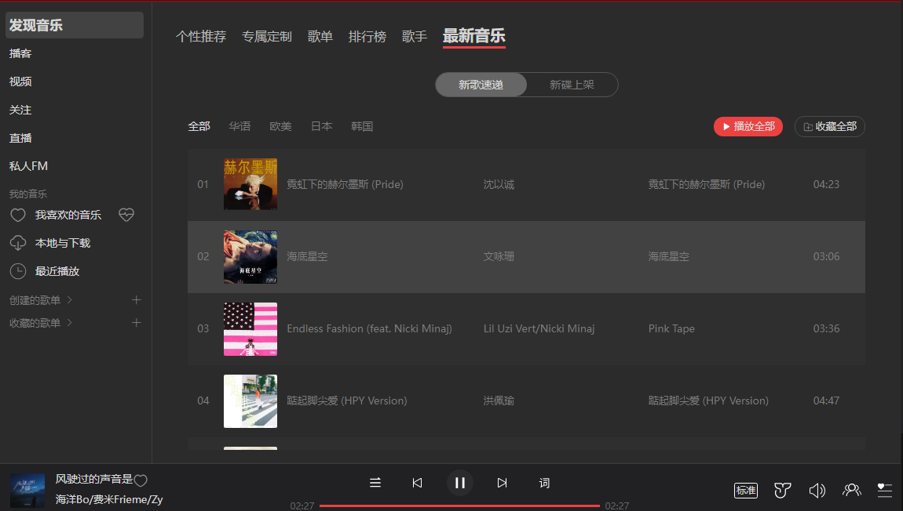
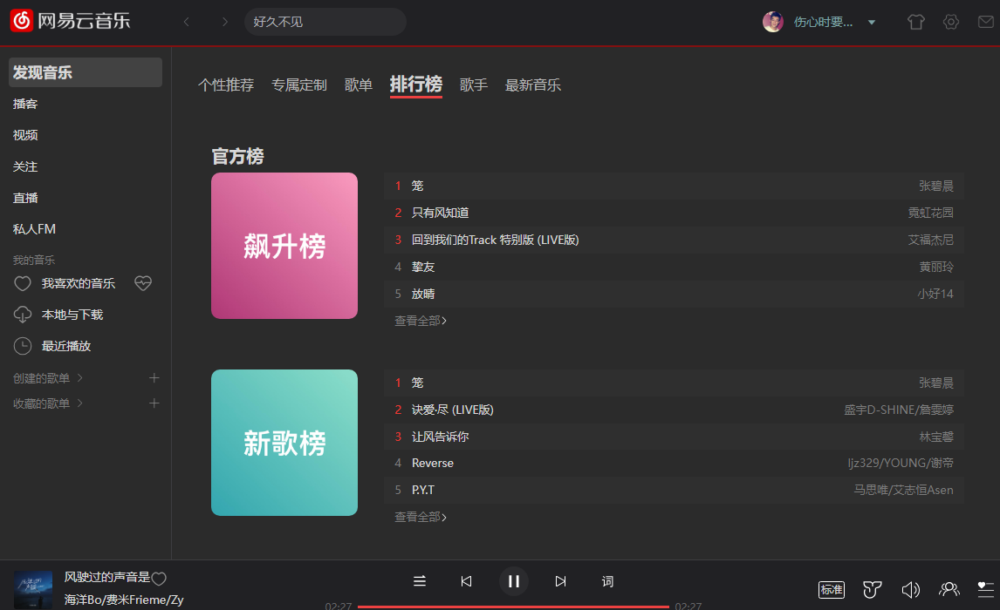
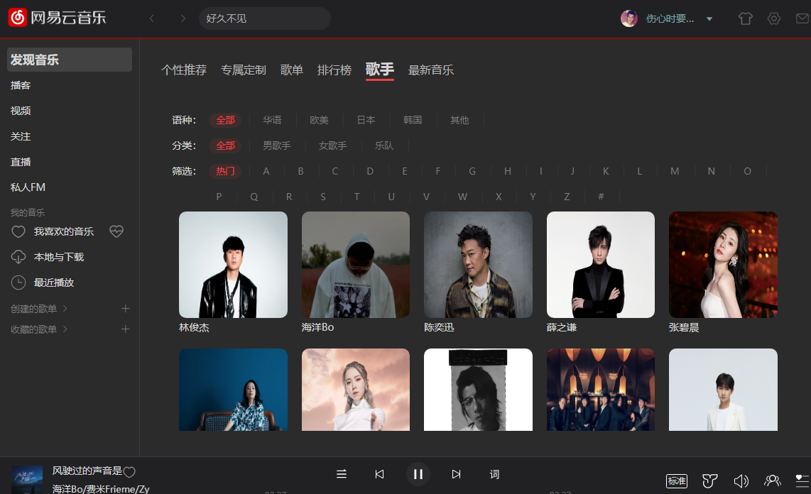
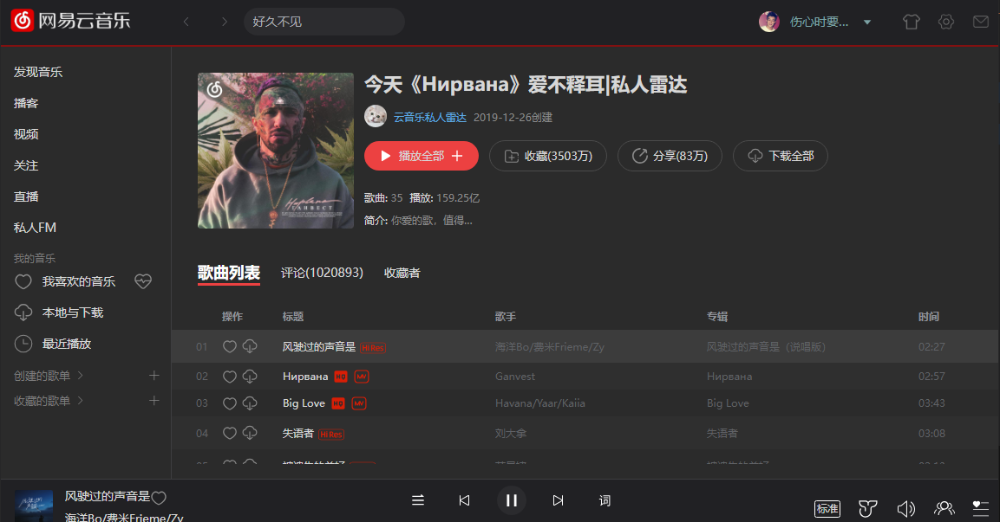
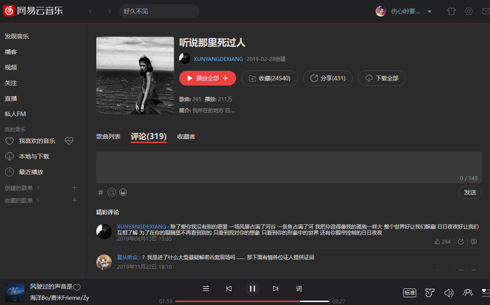

## [线上 DEMO](https://www.dshijie.fun/#/index/find-music/personalized-recommendations)

首次加载可能需要手动刷新浏览器一次

### [接口](https://github.com/Binaryify/NeteaseCloudMusicApi)

线上服务部分接口存在问题
建议 clone 此项目本地运行

## Project Setup

```sh
pnpm install
```

### Compile and Hot-Reload for Development

```sh
pnpm run dev
```

### Type-Check, Compile and Minify for Production

```sh
pnpm run build
```

### Compile and Hot-Reload for Electron

```sh
pnpm run electron
```

### Minify and Electron build

```sh
pnpm run electron:build
```

## 部分页面截图

### 发现音乐->歌单



### 发现音乐->排行榜



### 发现音乐->歌手



### 发现音乐->最新音乐


### 歌单详情->歌曲列表



### 歌单详情->评论列表



## 演示视频


