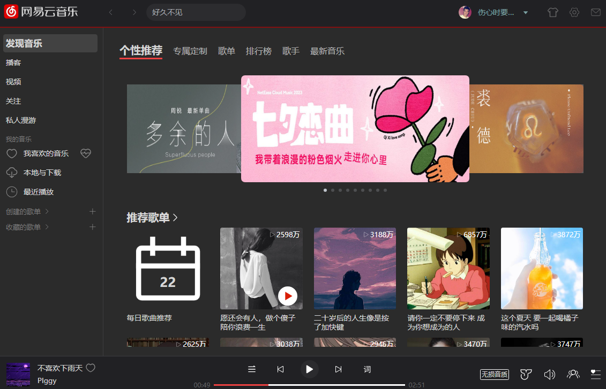
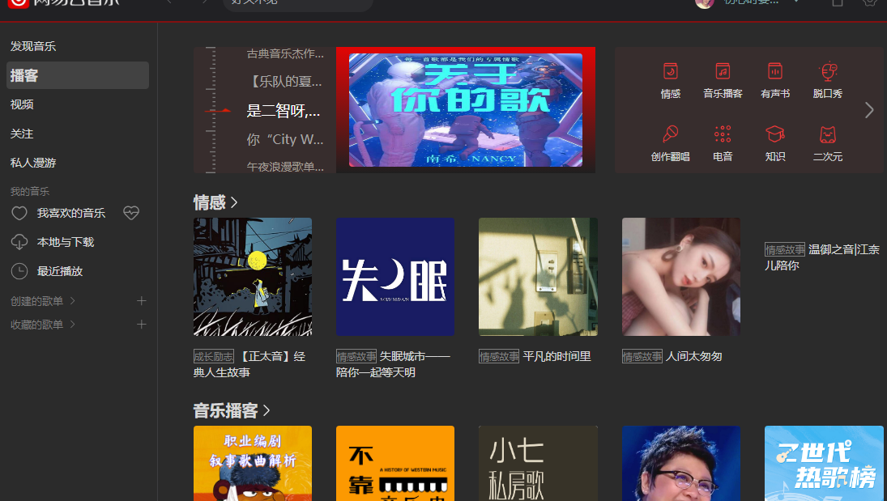
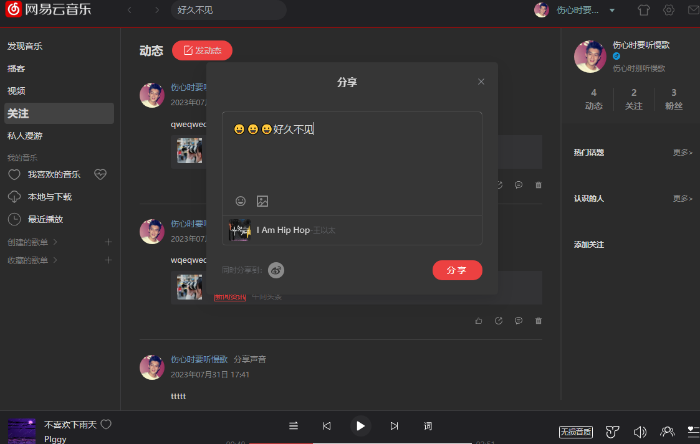
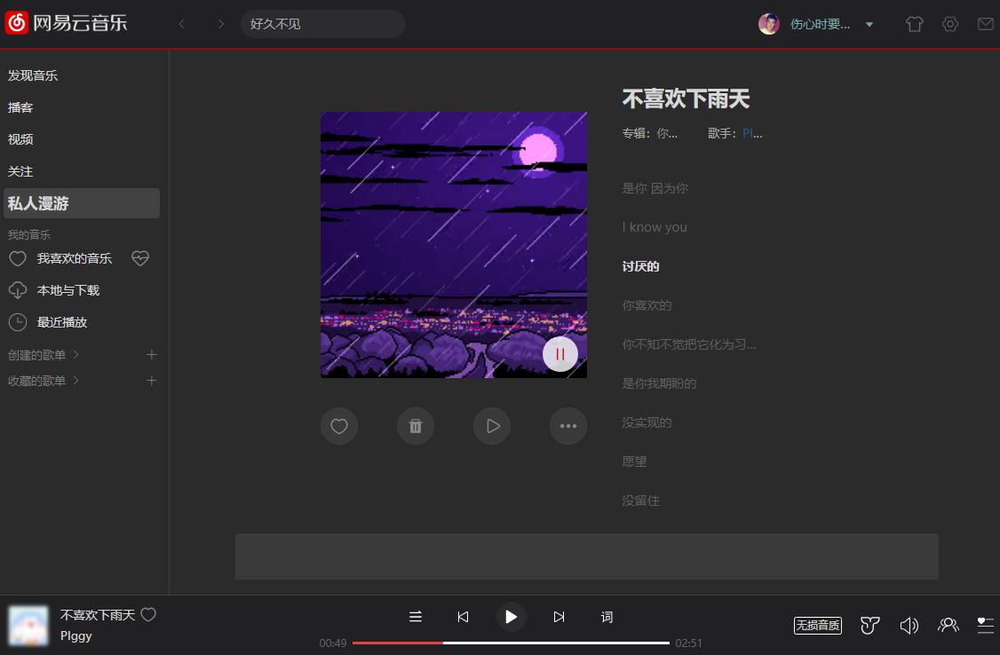
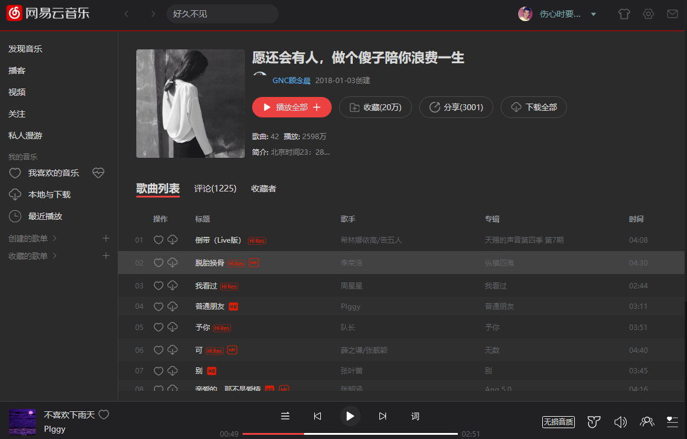
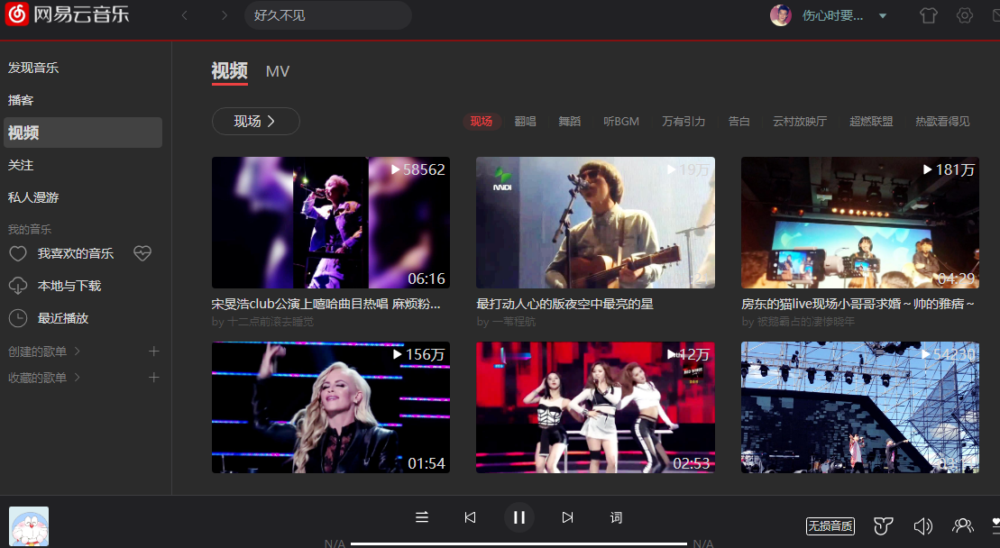
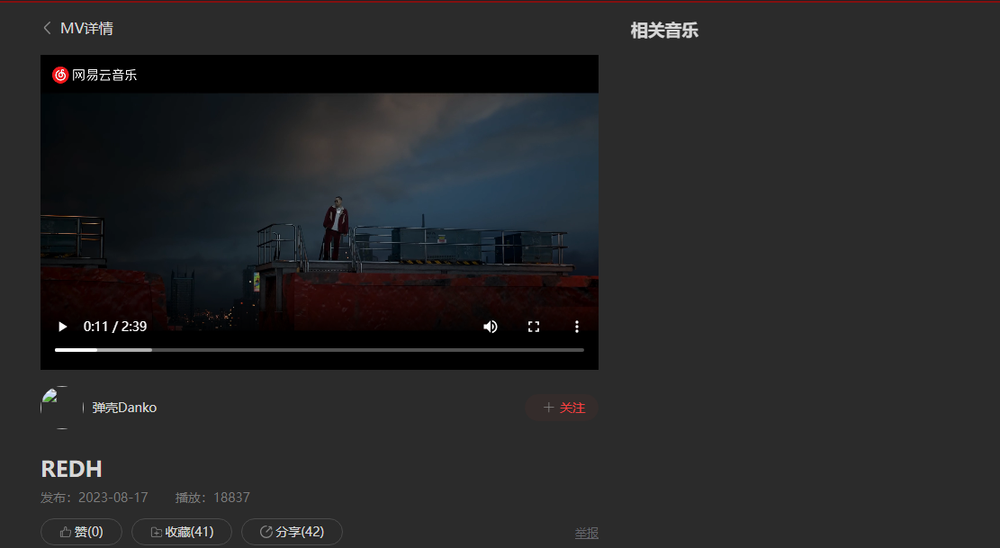
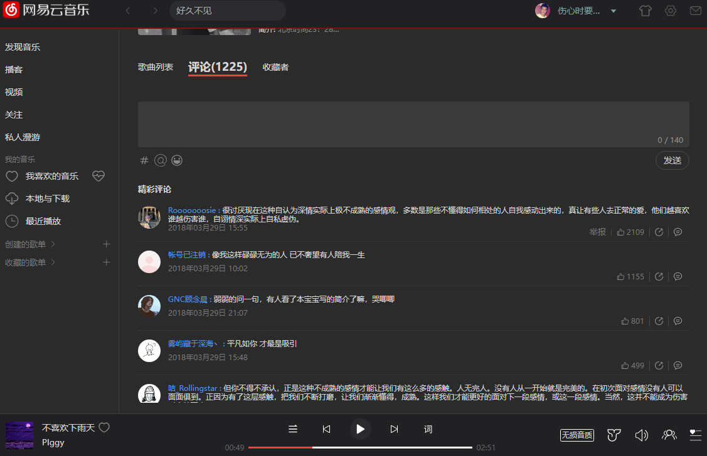
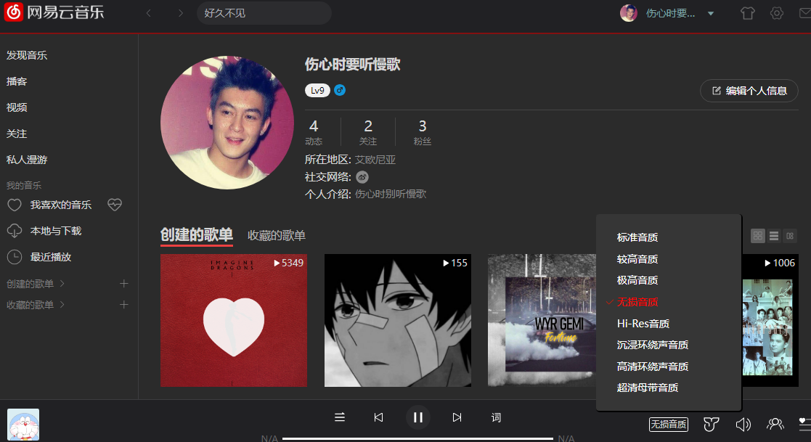

## [线上 DEMO](https://www.dshijie.fun/#/index/find-music/personalized-recommendations)

首次加载可能需要手动刷新浏览器一次
线上登录接口存在无法登录问题

### [接口服务](https://github.com/Binaryify/NeteaseCloudMusicApi)

线上服务部分接口存在问题
建议 clone 此项目与网易云接口本地运行
因接口原因本地登录服务密码与邮箱验证无效，只能进行二维码登录

## Project Setup

```sh
pnpm install
```

### Compile and Hot-Reload for Development

```sh
pnpm run dev
```

### Type-Check, Compile and Minify for Production

```sh
pnpm run build
```

### Compile and Hot-Reload for Electron

```sh
pnpm run electron
```

### Minify and Electron build

```sh
pnpm run electron:build
```

## 部分页面截图

### 发现音乐



### 播客



### 关注



### 私人漫游



### 歌单详情



### 视频列表



### 视频详情



### 评论



### 用户信息


